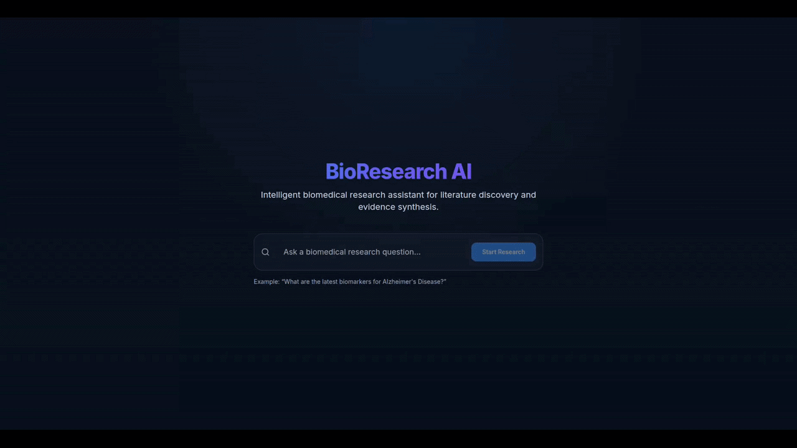
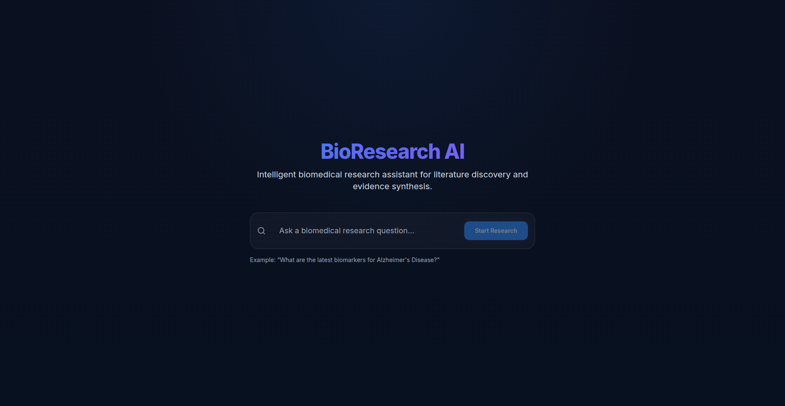
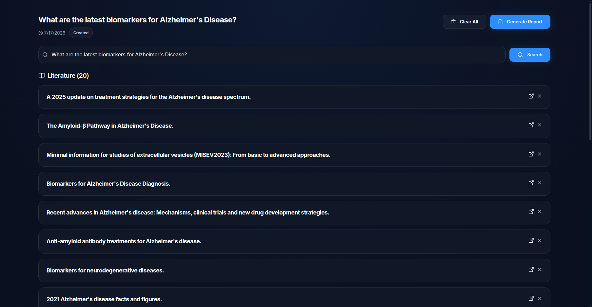
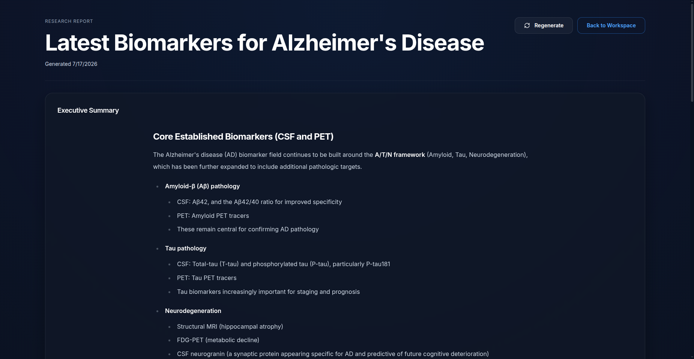
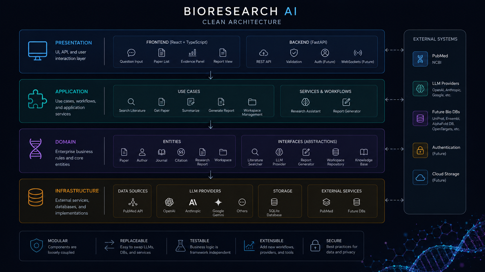

<p align="center">
  
</p>

<h1 align="center">
BioResearch AI
</h1>

<p align="center">
An AI-powered research assistant for biomedical literature discovery, evidence synthesis, and scientific reasoning.
</p>

<p align="center">
<strong>One-command install:</strong> <code>git clone && python3 bootstrap.py</code> &middot; see <a href="./INSTALL.md">INSTALL.md</a>
</p>

<p align="center">


[](https://github.com/grfone/bioresearch-ai/actions/workflows/ci.yml)

</p>

---

# Demo

<p align="center">

</p>

---

# Why BioResearch AI?

Biomedical researchers spend countless hours searching PubMed, reading papers, comparing results, and synthesizing evidence before reaching meaningful conclusions.

BioResearch AI transforms this workflow into an AI-assisted research experience.

Ask a biomedical question in natural language...

> **Can GLP-1 receptor agonists slow the progression of Alzheimer's disease?**

BioResearch AI will:

- 🔍 Search PubMed, OpenAlex, Europe PMC, and bioRxiv in parallel
- 📄 Retrieve relevant publications
- 🧠 Generate AI-powered summaries
- ⚖️ Compare findings across studies
- 📚 Produce citation-aware executive reports
- ✅ Keep every conclusion linked to the supporting evidence

The goal is **not to replace scientists**, but to help them navigate biomedical literature faster and make evidence-based decisions.

---

# Workflow

A typical researcher session takes about five steps. The
workspace is a deterministic finite state machine — each
step unlocks the next, and illegal actions are rejected
with HTTP 409 + the list of legal alternatives.

```text
[ 1 ] Ask a research question in natural language.
        │
        ▼
[ Page: Home, FSM: INITIAL ]
        │
        ▼
[ 2 ] Click "Search". The app auto-searches PubMed,
      OpenAlex, Europe PMC, and bioRxiv in parallel. The
      workspace advances to INTERMEDIATE and the user is
      navigated to the Workspace page.
        │
        ▼
[ Page: Workspace, FSM: INTERMEDIATE ]
        │
        ▼
[ 3 ] Review the hit list. Add more papers -- by
      DOI/PMID bulk paste, single DOI, PDF upload (DOI on
      the first page is auto-extracted), or title fallback.
      Remove irrelevant papers with one click. Click into
      a paper's DOI link to read the source.
        │
        ▼
[ Page: Workspace, FSM: INTERMEDIATE ]   (still -- adding
                              or removing papers does not
                              change the state)
        │
        ▼
[ 4 ] Click "Generate Report". The orchestrator runs the
      full pipeline server-side: summarise -> report ->
      PDF -> LaTeX. The workspace advances to FINAL and
      the user is navigated to the Report page.
        │
        ▼
[ Page: Report, FSM: FINAL ]
        │
        ▼
[ 5 ] Read the report. Every claim is citation-linked back
      to the workspace's paper set -- the anti-fabrication
      guard rejects any citation that does not match.
```

The full state machine:

```text
INITIAL ──search──▶ INTERMEDIATE ──generate──▶ FINAL
                       │                            │
                       ├─back_to_home──▶ INITIAL    └─back_to_workspace──▶ INTERMEDIATE
                       └─ERROR (recoverable: retry, add_paper, remove_paper)
```

The FSM is **linear since 2026-08-31** (see [ADR-017](docs/adr/ADR-017-three-page-fsm.md)):
nine states collapsed to four (`INITIAL`, `INTERMEDIATE`, `FINAL`,
`ERROR`), with transient in-flight markers (SEARCHING, SUMMARIZING,
REPORTING, PUBLISHING) removed because the UI's spinner is the source
of truth for "operation in flight." The cross-paper evidence-comparison
intermediate (COMPARING → COMPARED, removed 2026-08-30, ADR-016) and the
PUBLISH / COMPLETE actions are also gone — `generate` does everything
in one shot (summarise + report + PDF + LaTeX).

The four states map 1:1 to the three user-facing pages (Home, Workspace,
Report) plus an ERROR page. `INTERMEDIATE → FINAL` is a single `generate`
action that runs the full pipeline server-side; the FSM does not need to
care about the steps internally. The `page` field on
`WorkspaceResponse` carries the front-end route token (`home` /
`workspace` / `report` / `error`) so the SPA can route without parsing
the FSM state.

The FSM is documented in [`app/core/enums/workspace_state.py`](app/core/enums/workspace_state.py)
and the orchestrator in [`WorkspaceOrchestrator`](app/application/services/workspace_orchestrator.py).
The frontend mirrors the FSM state in its lab-bench UI: enabled
buttons depend on `workspace.allowed_actions`, which is the
legal-next-actions list for the current state.

See [ADR-008](docs/adr/ADR-008-one-click-report-from-papers-retrieved.md)
for the historical one-click-report decision and
[ADR-017](docs/adr/ADR-017-three-page-fsm.md) for the 2026-08-31
simplification that mapped the FSM to the three pages.

---

# Features

| Feature | Description |
|----------|-------------|
| 🔍 Literature Search | Search PubMed, OpenAlex, Europe PMC, and bioRxiv in parallel from a single natural-language query |
| 📄 Paper Summaries | Generate concise AI summaries for each publication |
| 🧠 Evidence Synthesis | Combine evidence from multiple studies |
| 📚 Citation Awareness | Every report references the supporting papers — and the link is *clickable* in the compiled PDF |
| � Clickable DOI | Bibliography entries include real, linkified DOIs (in both the PDF and the LaTeX source) |
| 📑 PDF Upload | Drop a PDF, the DOI/PMID on the first page is auto-extracted and resolved |
| 📝 Generate PDF | One-click download — the button auto-saves `report-<id>.pdf` (no extra click) |
| 📝 Generate TeX | One-click download — the button auto-saves `report-<id>.tex` for editing in Overleaf / TeXstudio |
| 📊 Prometheus metrics | `/metrics` endpoint exports sanitizer counters, title-fallback rate, and gauges for scraping |
| 🩺 Sanity telemetry | `/health/sanitizer` and `/health/title-fallback` endpoints report in-process LLM-safety counters |
| ⚡ FastAPI Backend | REST API following Clean Architecture |
| 🎨 React Frontend | Modern and responsive user interface |
| 🧩 Modular LLM Providers | Easily switch between multiple AI providers |
| 💾 Persistent Workspaces | Save and continue research sessions |

---

# Screenshots

## Home

<p align="center">

</p>

---

## Literature Search

<p align="center">

</p>

---

## Executive Report

<p align="center">

</p>

---

# What's new since v0.1.0

A snapshot of the work since the first public release:

- **Deterministic four-state finite state machine** for the workspace lifecycle (`INITIAL → INTERMEDIATE → FINAL`, plus `ERROR`) — illegal actions are rejected with HTTP 409 and the list of legal next actions is returned in the envelope (see [ADR-017](docs/adr/ADR-017-three-page-fsm.md))
- **Lab-bench UI** with state, progress, action availability, and transition history
- **PDF upload** — drop a PDF, the DOI/PMID on the first page is auto-extracted and resolved (200 MB cap, configurable via `PDF_UPLOAD_MAX_BYTES`)
- **Multi-worker ready** via a pluggable cache backend (in-memory by default, Redis for multi-worker deployments)
- **One-click install** via `python3 bootstrap.py` (detects OS, installs Docker, builds the image, opens the running app). The bootstrap now also recovers automatically from DNS hiccups and broken IPv6 routing on the user's host.
- **Vancouver-style citations** — `[paper:N]` markers in the body map to a numbered, hyperlinked bibliography; the anti-fabrication guard sanitises any LLM-hallucinated citation indices at ingest
- **One-shot `generate` action** — pressing "Generate Report" runs the full pipeline server-side (summary → report → PDF → LaTeX) and returns the rendered report in one HTTP response. The "Generate PDF" button on the Report page just triggers the browser download.
- **Multi-page PDF + Unicode coverage** — the published PDF uses DejaVu Sans (TTF-embedded via reportlab) so Greek letters, Latin diacritics, em-dashes, and bold sub-headings render correctly; numbered references are real clickable internal `/Dest` annotations
- **Clickable DOI links** — bibliography entries include `https://doi.org/...` URLs that are clickable in both the PDF and the LaTeX source
- **Generate PDF / Generate TeX buttons** — the report action auto-downloads the PDF on success, and a second blue button downloads the LaTeX source for editing in Overleaf / TeXstudio before recompiling
- **Observability** — `/metrics` (Prometheus text format) and `/health/sanitizer` + `/health/title-fallback` endpoints expose in-process LLM-safety counters and the title-fallback rate (with a warning log when >50% over a 20-call window)
- **H1 title fallback** — if the synthesis LLM omits the `# ` heading, we inject one from the first sentence (idempotent) so the report always has a real title (instead of "Untitled" or the body duplicated as the title)
- **Anti-fabrication sanitizer telemetry** — every call to the citation marker sanitizer is logged + counted, so you can see the running total via `/health/sanitizer` and confirm the guard is doing its job
- **17 ADRs** documenting the architectural decisions (see [Design decisions](#design-decisions))

See the [Roadmap](#roadmap) below for what's left.

---

# Software Architecture

<p align="center">

</p>

The project follows **Clean Architecture** and **Domain-Driven Design (DDD)**.

```text
Presentation

↓

Application

↓

Domain

↓

Infrastructure
```

This separation allows the frontend, AI providers, databases, and APIs to evolve independently while keeping the core business logic isolated and testable.

Adding a new LLM provider or biomedical database requires implementing a new adapter rather than modifying the application core.

---

# Technology Stack

## Backend

- Python
- FastAPI
- SQLAlchemy
- SQLite
- Pydantic
- LangGraph
- OpenAI API
- PubMed API

---

## Frontend

- React
- TypeScript
- Vite
- TailwindCSS

---

## Architecture

- Clean Architecture
- Domain-Driven Design
- Dependency Injection
- Repository Pattern
- Modular LLM Providers

---

# Installation

The fastest way to run BioResearch AI on any machine:

```bash
git clone https://github.com/grfone/bioresearch-ai.git
cd bioresearch-ai
python3 bootstrap.py
```

`bootstrap.py` is the single entry point. It detects your OS, installs Docker if needed, builds the image, opens a first-run GUI that asks for your LLM credentials, probes each one live, and finally opens the running app in your default browser.

See [`INSTALL.md`](./INSTALL.md) for the full step-by-step, troubleshooting, and the daily workflow.

## Quick smoke test

Once you've got the app running, verify it works end-to-end:

```bash
make verify
```

This runs `scripts/verify.sh`, which builds the container, hits every `/admin/*` endpoint, fetches a real Nature DOI, and tears down. See the script header for the full step list.

---

## Manual installation (advanced)

If you prefer not to use Docker:

### Backend

Create the Conda environment

```bash
conda env create -f environment.yaml
```

Activate it

```bash
conda activate bioresearch-ai
```

Configure the environment variables

```bash
cp .env.example .env
```

Add your API keys inside the `.env` file.

### Frontend

Navigate to the frontend directory

```bash
cd frontend
```

Install the dependencies

```bash
npm install
```

---

# Running the Project

The backend and frontend run independently.

## Backend

From the project root

```bash
uvicorn main:app --reload
```

The backend API will be available locally.

## Frontend

Open another terminal

```bash
cd frontend

npm run dev
```

The frontend will start with hot reloading enabled.

---

# Current Capabilities

- ✅ Biomedical literature search (PubMed, OpenAlex, Europe PMC, bioRxiv)
- ✅ Paper retrieval
- ✅ AI-powered paper summarization (auto-summarises when the user skips the explicit step — see [ADR-008](docs/adr/ADR-008-one-click-report-from-papers-retrieved.md))
- ✅ Cross-paper evidence comparison (consensus, contradictions, gaps, future directions, side-by-side matrix)
- ✅ Citation-aware executive reports
- ✅ Anti-fabrication guard: every citation is checked against the workspace's paper set
- ✅ Persistent research workspaces
- ✅ Deterministic finite state machine (FSM) lifecycle — see the [Workflow](#workflow) section
- ✅ Illegal action rejection (HTTP 409) with the list of legal next actions
- ✅ LangGraph workflow topology (in [`app/application/workflows/research_workflow.py`](app/application/workflows/research_workflow.py))
- ✅ Lab-bench UI: state, progress, action availability, transition history
- ✅ Modern React frontend
- ✅ FastAPI REST API
- ✅ Modular LLM providers
- ✅ Clean Architecture implementation
- ✅ 806 backend + 289 frontend tests passing
- ✅ CI on every push (see [`docs/ci.md`](docs/ci.md))

---

# Roadmap

The long-term vision is to build an AI platform capable of supporting the complete scientific workflow.

| Status | Feature |
|--------|----------|
| ✅ | PubMed Search |
| ✅ | Paper Retrieval |
| ✅ | AI Paper Summaries |
| ✅ | Executive Reports |
| ✅ | React Frontend |
| ✅ | **Evidence Comparison** — cross-paper consensus, contradictions, gaps, and a side-by-side matrix |
| ✅ | **LangGraph Workflows** — deterministic FSM topology + `WorkspaceOrchestrator` runtime |
| ✅ | **Workspace Management** — lab-bench UI with state, allowed actions, progress, and history |
| ✅ | **PDF Report Export** — multi-page, Unicode-correct, with clickable numbered refs and DOIs (rendered via reportlab + DejaVu Sans) |
| ✅ | **LaTeX Report Export** — `GET /workspaces/{id}/published-report.tex` renders the same structured report as a `.tex` source the user can compile with `pdflatex` |
| ✅ | **Observability** — `/metrics` (Prometheus), `/health/sanitizer`, `/health/title-fallback` |
| ✅ | **Anti-fabrication guard telemetry** — every citation marker sanitizer call is counted + logged |
| 🚧 | Biological Knowledge Integration |
| 🔜 | Multi-Agent Collaboration |
| 🔜 | Long-Term Memory |
| 🔜 | MCP Integration |
| 🔜 | Agent-to-Agent Communication |
| 🔜 | Knowledge Graph Construction |

---

# Repository Structure

```text
bioresearch-ai/

├── app/
│   ├── api/
│   ├── application/
│   │   ├── services/
│   │   ├── use_cases/
│   │   └── workflows/
│   ├── config/
│   ├── core/
│   │   ├── enums/
│   │   └── ...
│   ├── domain/
│   │   ├── entities/
│   │   ├── interfaces/
│   │   └── value_objects/
│   ├── infrastructure/
│   │   ├── cache/
│   │   ├── latex/           # NEW: LaTeX source export
│   │   ├── literature/
│   │   ├── llm/
│   │   ├── observability/   # NEW: Prometheus /metrics
│   │   ├── pdf/             # reportlab-based PDF generator
│   │   ├── pubmed/
│   │   └── storage/
│   └── presentation/

├── frontend/

├── docs/
│   ├── images/
│   ├── gifs/
│   ├── architecture.md
│   ├── ci.md
│   ├── repository.md
│   └── adr/                # 9 ADRs (see Design decisions)

├── tests/
│   ├── unit/               # 806 tests
│   └── integration/        # 35 tests (FSM end-to-end)

├── notebooks/
├── scripts/
└── README.md
```

---

# Design decisions

We capture every non-trivial architectural decision in an Architecture Decision Record (ADR). ADRs document the context, the chosen approach, the alternatives considered, and the consequences — both positive and negative. Future contributors read them to understand *why* the system works the way it does.

| ADR | Decision | Status |
|-----|----------|--------|
| [ADR-001](docs/adr/ADR-001-adopt-clean-architecture.md) | Adopt Clean Architecture | Accepted |
| [ADR-002](docs/adr/ADR-002-adopt-domain-driven-design) | Adopt Domain-Driven Design | Accepted |
| [ADR-003](docs/adr/ADR-003-pluggable-cache-backend.md) | Pluggable cache backend (in-memory vs Redis) | Accepted |
| [ADR-004](docs/adr/ADR-004-section-based-abstract-extraction.md) | Section-based abstract extraction | Accepted |
| [ADR-005](docs/adr/ADR-005-multi-identity-paper-dedup.md) | Multi-identity paper deduplication (PMID/DOI/title) | Accepted |
| [ADR-006](docs/adr/ADR-006-parallel-multi-source-search.md) | Parallel multi-source literature search | Accepted |
| [ADR-007](docs/adr/ADR-007-configurable-pdf-upload-cap.md) | Configurable PDF upload size cap (200 MB default) | Accepted |
| [ADR-008](docs/adr/ADR-008-one-click-report-from-papers-retrieved.md) | One-click report from PAPERS_RETRIEVED (superseded by ADR-017) | Accepted |
| [ADR-009](docs/adr/ADR-009-publishing-state.md) | `PUBLISHING` FSM state for PDF export + four-layer audit pattern (superseded by ADR-017) | Accepted |
| [ADR-010](docs/adr/ADR-010-pdf-and-latex-export.md) | Reportlab-based multi-page PDF + LaTeX export + clickable numbered references | Accepted |
| [ADR-011](docs/adr/ADR-011-vancouver-citations-anti-fabrication.md) | Vancouver-style citations + anti-fabrication sanitizer at ingest | Accepted |
| [ADR-012](docs/adr/ADR-012-fsm-aware-report-action.md) | FSM-aware REPORT action returns full `ReportResponse` (overload pattern) | Accepted |
| [ADR-013](docs/adr/ADR-013-h1-title-fallback.md) | H1 title fallback when the synthesis LLM omits the heading | Accepted |
| [ADR-014](docs/adr/ADR-014-prometheus-metrics-health-probes.md) | Prometheus `/metrics` exposition + JSON `/health/*` probes | Accepted |
| [ADR-015](docs/adr/ADR-015-bootstrap-dns-ipv6-retry-auto-fix.md) | Bootstrap DNS + IPv6 retry with opt-in auto-fix | Accepted |
| [ADR-016](docs/adr/ADR-016-remove-compared-state.md) | Remove the COMPARING/COMPARED FSM states — see ADR for the four-layer audit | Accepted |
| [ADR-017](docs/adr/ADR-017-three-page-fsm.md) | Collapse the FSM to four states mapped 1:1 to the three pages (Home / Workspace / Report) | Accepted |

Five ADRs are particularly worth reading for new contributors:

- **[ADR-003](docs/adr/ADR-003-pluggable-cache-backend.md)** — the
  in-memory vs Redis cache split and the multi-worker
  fragmentation fix.
- **[ADR-005](docs/adr/ADR-005-multi-identity-paper-dedup.md)** —
  why a paper is deduplicated by PMID/DOI/title but title
  is a *weak* signal.
- **[ADR-008](docs/adr/ADR-008-one-click-report-from-papers-retrieved.md)** —
  why the FSM gate from `PAPERS_RETRIEVED` to `REPORT`
  exists and how the orchestrator auto-summarises when
  needed.
- **[ADR-009](docs/adr/ADR-009-publishing-state.md)** — the
  four-layer audit pattern (FSM table → orchestrator →
  structural → frontend wire-format) that is the standing
  recipe for any new FSM action.

---

# Documentation

Additional documentation is available in:

- 📘 ARCHITECTURE.md
- �️ ROADMAP.md
- 🤝 CONTRIBUTING.md
- 🔒 SECURITY.md
- 📝 CHANGELOG.md
- ⚙️ [CI](docs/ci.md) — Continuous Integration workflow
- 🏛️ [ADRs](docs/adr/README.md) — Architecture Decision Records

---

# Design Philosophy

BioResearch AI follows three engineering principles.

- Modular
- Replaceable
- Testable

Every AI provider, literature source, biological database, and workflow is designed as an interchangeable component.

The objective is to build an extensible platform for biomedical AI rather than a single-purpose application.

---

# Contributing

Contributions are welcome.

Whether you're:

- adding new LLM providers,
- integrating biomedical databases,
- improving the frontend,
- implementing scientific workflows,
- fixing bugs,
- or improving documentation,

your contributions are greatly appreciated.

Please read **CONTRIBUTING.md** before opening a Pull Request.

---

# License

Released under the MIT License.

See the LICENSE file for details.
